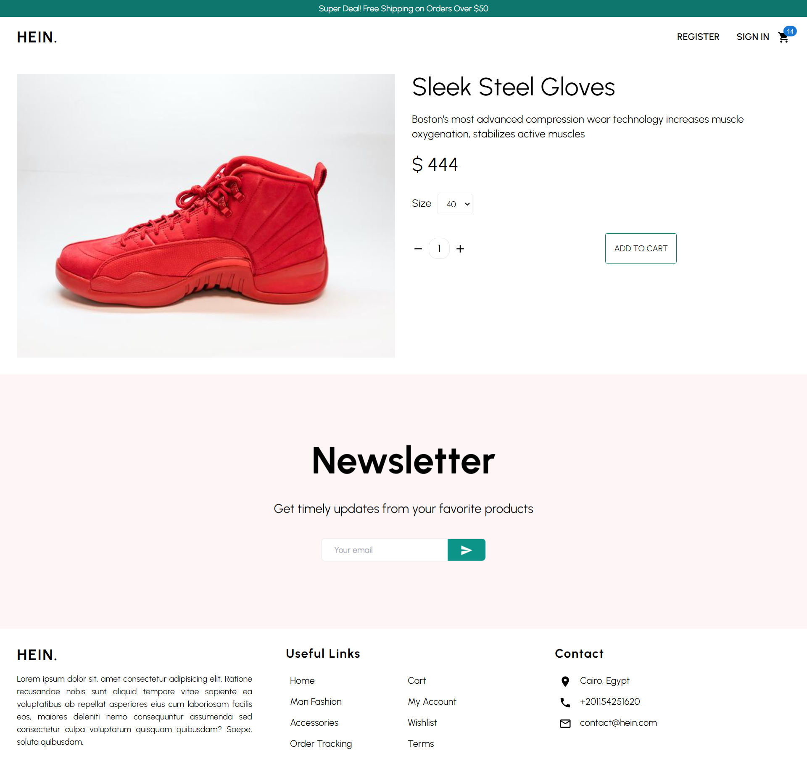
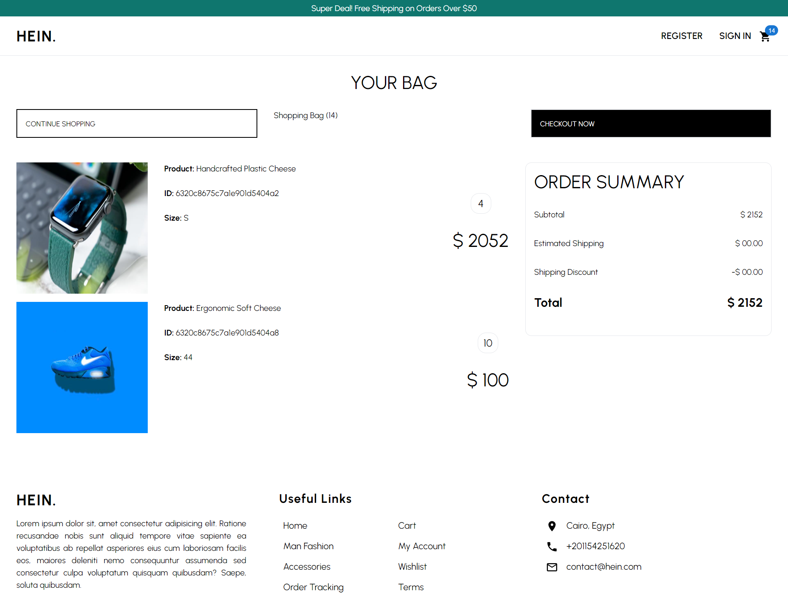
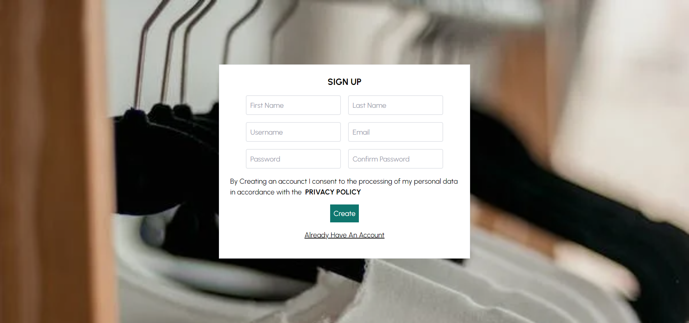
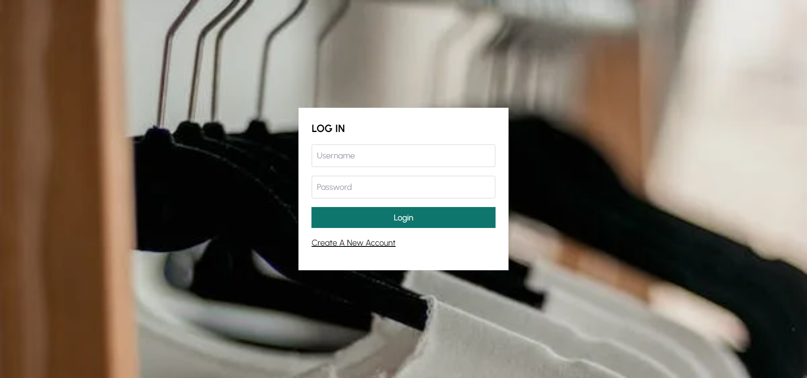

# Quickmart Ecommerce Website


Ecommerce Web Application built with the MERN Stack.


## 🏁 Get Started


1. **_Clone the repository_**


```sh
git clone https://github.com/prachi1619/QuickmartEcommerceWebsite.git
```


2. **_Navigate to the repository directory_**


```sh
$ cd QuickMartEcommerceWebsite
```


### 💻 Client


1. **_Navigate to the client directory_**


```sh
$ cd QuickmartClient
```


2. **_Install dependencies_**


```sh
$ npm install
```


#### Running


1. **_Compile and hot-reload for development_**


```sh
$ npm run dev
```


2. **_Compile for production_**


```sh
$ npm run build
```


### 💻 Server


1. **_Navigate to the server directory_**


```sh
$ cd QuickmartServer
```


2. **_Install dependencies_**


```sh
$ npm install
```


#### Running


1. **_Compile and hot-reload for development_**


```sh
$ npm run start
```


2. **_Compile for production_**


```sh
$ npm run build
```


## 💻 Built With


- **ReactJS**
- **Redux**
- **NodeJS**
- **ExpressJS**
- **MongoDB**
- **TailwindCSS**
- **Stripe**

## 📷 Screenshots

- ### Large Screens
  
  <br>
  
  <br>
  
  <br>
  
  <br>
  
  <br>
  
